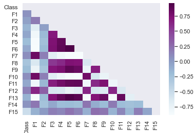
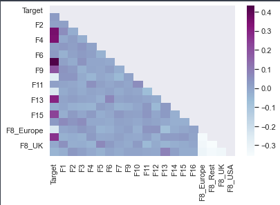

# Part 2 development

## Preprocessing

For preprocessing and feature engineering it was noticed that there were no categorical engineering so it was needed to do some type of encoding for the features. Nevertheless it was noticed that there was a feature had null values (F15), for this case what it was done was to fill those NaN values with the median value of the column

## Data analysis

Later on we decided to analyze the data and the overall behavior, if there were any correlation between the features, in addition to see based on the unique values of the features see if it would be possible that there were discrete variables. The former is mainly to create a Bayesian model that requires that we used all the values of the labels for training.

Based on this analysis some results were brought as conclusion

### Features and class correlation

<!-- COUNT: 149 -->

{#fig:1}

As shown with the fig. @fig:1, it was noticed that some features in particular seems to have more correlation than others with the class variables, being those features:

- F1
- F7
- F10
- F12
- F14

### Discrete features

To be able to know which features could be discrete what it was done was to classify as discrete features those features which count of unique values are less than 100. This value was chosen after seeing the count of all unique values for all the features (These counts can be seen in Table 1).

<!-- COUNT: 96 -->

| Feature | Count |
| -       | -     |
| F1      | 656   |
| F2      | 432   |
| F3      | 141   |
| F4      | 650   |
| F5      | 4     |
| F6      | 214   |
| F7      | 660   |
| F8      | 91    |
| F9      | 400   |
| F10     | 649   |
| F11     | 646   |
| F12     | 11    |
| F13     | 216   |
| F14     | 80    |
| F15     | 331   |
Table: Count of unique values of all the features

By performing this algorithm is possible to know that the discrete features are the following:

- F5
- F8
- F12
- F14

## Selected learning procedures to experiment

For creating the final model 4 learning procedures were chosen, being the following:

- _DecisionTreeClassifier_
- _Support Vector Machine_, in specific a _C-Support Vector Classification_
- _Neural Network Classifier_, in specific a _Multi Layer Perceptron_ with 3 hidden layers, having as output activation function a softmax function.
- _Categorical Naive-Bayes_

## Parameters to experiment with

### DecisionTreeClassifier

- _max_depth_. This parameter defines the max depth that the tree can have if not restricted it will go on until all leaves are pure. The value is always an integer. The values used for experimenting with are: `[2, 8, 64, 256]`
- _min_samples_split_. The value of this parameter defines the minimum number of samples required to split an internal node. The value is always an integer. The values used for experimenting with are: `[2, 4, 8]`
- _max_features_. This values is the max number of features considered when looking for the best split. The values can be an integer or a value of the following enum `{'auto', 'sqrt', 'log2'}`, the auto value is the default value which is the same as sqrt. The values used for experimenting with are: `['sqrt', 'log2', None]`

### SVC

- _C_. The regularization parameter. It must be a positive number, the default value is 1.0. The values used for experimenting with are: `[0.5, 1, 2, 4]`
- _kernel_. Specifies the type of kernel type to be used. The value can be either of the following list `{'linear', 'poly', 'rbf', 'sigmoid', 'precomputed'}`, the default value is 'rbf'. The values used for experimenting with are: `['poly', 'rbf', 'sigmoid']`
- _gamma_. Kernel coefficient for 'rbf', 'poly' and 'sigmoid'. Which values are either 'scale' or 'auto', thus these values will be the one we will be experimenting with.

### Neural Network

For the Neural Networks we will be experimenting by checking different permutations of the values of the number of units of the layer and its activation function, these values will be the following:

- Units of the layer: `[5, 10, 20, 50]`
- Activation functions: `['tanh', 'relu', 'sigmoid']`

The algorithm used was using these values create all the possible combinations, these would be it, but as all these combinations are needed to experiment with for each of the layers, then it's needed to create more combinations of it. This can be simplified with the following pseudo-code:

<!-- COUNT: 415 -->

```
products = product(units, functions)
all_combinations = product(products, products, products)
```

### Categorical Naive-Bayes

This will be the only model that we will not experiment at lot with, mainly because the scikit-learn library module doesn't have a lot of parameters to experiment with.

## Experimenting with different datasets

An extra aspect that was used for experimenting is with the dataset used for training. The difference between the datasets are the features which will be used for training: One will use all the features that has the table, meanwhile the other one have those values previously mentioned that have a higher correlation with the class column. These aspect will be used to experiment with the decision tree, the SVM and the NN.

## Experiment Results

<!-- COUNT: 113 -->

| Model                                  | Score  | Parameters                                 |
| ---                                    | -      | ---                                        |
| DecisionTreeClassifier (Complete)      | 0.7978 | (8, 2, None)                               |
| SVM (Complete)                         | 0.8955 | (4, 'poly', 'scale')                       |
| NeuralNetwork (Complete)               | 0.8733 | ((50, 'relu'), (50, 'relu'), (50, 'relu')) |
| DecisionTreeClassifier (Correlational) | 0.6711 | (8, 8, 'sqrt')                             |
| SVM (Correlational)                    | 0.6711 | (0.5, 'rbf', 'scale')                      |
| NeuralNetwork (Correlational)          | 0.6755 | ((50, 'relu'), (50, 'relu'), (5, 'relu'))) |
| Naive-Bayes Classifier                 | 0.6178 | ----                                       |
Table: All models and their best possible score. _Note: The score is the mean accuracy of the model using validation data_

## Discussion

There are some conclusions that can be made from these results

1. When using all the features at our disposal it seems like there are better results than when using more selected variables. These are shown in all possible learning procedures, as all of them considerably declined in performance when changing the features to be modeled with
2. The Naive-Bayes classifier was not a very good learning procedure for this case. This can be done probably due to not having a lot of explicit deterministic features.
3. The best model was the SVM using the complete dataset and when the kernel was polynomial. This makes me thing if the performance would increase if we change the degrees of the kernel of the default 3.

# Part 3 development

## Preprocessing

For preprocessing and feature engineering it was noticed that even though there were no missing values, there were some categorical features that required to be numerically encoded, the F8 and F15 features.

For this, two different encoding techniques were used. For the F8 feature it was used a dummy encoding, while for the F15 feature the values were directly map into a numerical value without the need to add new values. Thus, for F15 the values were mapped following the mapping shown in table 3

<!-- COUNT: 179 -->

| Categorical Value | Numerical Value |
| -                 | -               |
| Very Low          | 0               |
| Low               | 1               |
| Medium            | 2               |
| High              | 3               |
| Very High         | 4               |
Table: F15 categorical values mapping

## Data analysis

{#fig:2}

As shown with the fig. @fig:2, it was noticed that some features in particular seems to have more correlation than others with the class variables, being those features:

- F3
- F4
- F7
- F8_Rest
- F9
- F13
- F15

## Selected learning procedures to experiment

For creating the final model 4 learning procedures were chosen, being the following:

- _LinearRegressor_
- _AdaBoostRegressor_
- _RandomForestRegressor_
- _Neural Network Classifier_, in specific a _Multi Layer Perceptron_ with 3 hidden layers, having as output activation function a linear function.

## Parameters to experiment with

### LinearRegressor

For this regressor there are no parameters to experiment with

### AdaBoostRegressor

- _n_estimators_. The number of estimators at which the boosting is terminated, this can be prior if the perfect fit was found. The values for this parameter must be an integer. The values which we'll use to experiment with are: `[25, 50, 100, 200]`
- _learning_rate_. The learning rate shrinks the contribution of the regressor. The value must be a number and the values which we'll use to experiment with are `[0.25, 0.5, 1, 2]`
- _loss_. The loss function that will be used to update the weights after each iteration. This must be of either of the following values: `['linear', 'square', 'exponential']`, which are the same we'll use to experiment with

### RandomForestRegressor

- _n_estimators_. The number of trees in the forest. The value must be an integer. The values which we'll use to experiment with are: `[25, 50, 100, 200]`
- _criterion_. The function used to measure the quality of a split. The value must be either of these: `['mse', 'mae']`, which will be the ones used to experiment with
- _max_depth_. This parameter defines the maximum depth that a tree could have. The value must be an integer number or `None`, if `None` is used, then it will split the leaves until they're pure. The values which we'll use to experiment with are: `[10, 40, 160, None]`
- _max_features_. This values is the max number of features considered when looking for the best split. The values can be an integer or a value of the following enum `{'auto', 'sqrt', 'log2'}`, the auto value is the default value which is the same as sqrt. The values used for experimenting with are: `['sqrt', 'log2', None]`

### Neural Network

The experimentation for the neural network will be the same as the one done in part 2. Same parameters will be experiment with and also the value of those parameters will be the same

<!-- COUNT: 431 - 1383 -->

## Experimenting with different datasets

Same as Part 2, in addition to parameter experimentation there's also an experiment in this part of using different datasets, one with all the features while another with only the ones that the target column has a higher correlation with. These datasets will be used to experiment with all learning procedures.

<!-- 1439 -->

## Experiment Results

| Model                                 | Score  | Parameters                                 |
| ---                                   | -      | ---                                        |
| LinearRegressor (Complete)            | 0.7710 | ---                                        |
| AdaBoostRegressor (Complete)          | 0.7180 | (200, 1, 'square')                         |
| RandomForestRegressor (Complete)      | 0.6824 | (100, 'mse', 40, 'auto')                   |
| NeuralNetwork (Complete)              | 0.9716 | ((20, 'tanh'), (50, 'relu'), (50, 'relu')) |
| LinearRegressor (Correlational)       | 0.6518 | -                                          |
| AdaBoostRegressor (Correlational)     | 0.5716 | (50, 2, 'square')                          |
| RandomForestRegressor (Correlational) | 0.6628 | (100, 'mse', 40, 'log2')                   |
| NeuralNetwork (Correlational)         | 0.7279 | ((50, 'tanh'), (50, 'relu'), (50, 'relu')) |
Table: All models and their best possible score. _Note: The score is the r2 of the model using validation data_

## Discussion

From the results shown in table 4, we can discuss the following:

1. When using all the features at our disposal it seems like there are better results than when using more selected variables. These are shown in all possible learning procedures, as all of them considerably declined in performance when changing the features to be modeled with.
2. Even though the AdaBoostRegressor is a popular learning procedure for regression problem it seems like in this case it was not the best option. Probably this could be solved by tuning even more the parameters but there's not certainty of it.
3. The best model was the NeuralNetwork using the complete dataset. At least based on the r2 score it seems like it's following very well the trend define by the target function, nevertheless having a r2 score as high as this one makes me worry that it may be overfitted to the training dataset.
